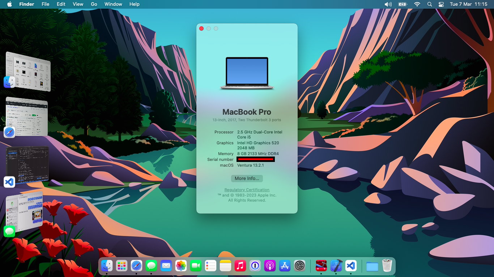

# Dell Latitude 7280 macOS

OpenCore files for my Dell Latitude 7280, currently booting macOS Ventura 13.2.1

Dell Latitude laptops are typically used in enterprise and built by a hardware asset manager to meet business demands. This means that each Dell Latitude may be slightly different depending on the business it came from. Check your specs before you blindly use this EFI, and consider adding -v to the boot-args to diagnose any issues. YMMV.

Remember to generate a serial number for iServices!

Combo Jack installer is included to enable the 3.5mm headphone jack (with EarPod support!).

## Laptop specs

| Component | Spec |
| ----- | ----- |
| CPU | Intel i5 6300U |
| iGPU | Intel® HD 520 Graphics |
| LAN | Intel I219-LM |
| Audio | Realtek ALC256 |
| RAM | Kingston 8 GB DDR4 2400 Mhz |
| Wi-Fi + Bluetooth | Intel 4MPRF |
| NVMe | SAMSUNG MZNLN128HAHQ-000H1 128 GB |
| SmBios | MacBookPro 14,1 |
| BootLoader | OpenCore 0.9.0 |
| macOS | Ventura 13.2.1 |

## Working/not working

| Component | Pass/fail |
| ----- | ----- |
| Graphics acceleration | ✅ |
| LAN | ✅ |
| Audio (including 3.5mm jack) | ✅ |
| Wi-Fi | ✅ |
| Bluetooth | ✅ |
| Webcam | ✅ |
| iServices | ✅ |
| Sleep/wake | ✅ |
| Native keyboard shortcuts* | ✅ |

`* ⌘cmd is mapped to Win`

## Screenshots

## Creating a boot USB

Read the [Dortania guide](https://dortania.github.io/OpenCore-Install-Guide/installer-guide/) for instructions on how to create a Hackintosh boot USB.

## Bios settings

### Enable
* SATA Operation : AHCI
* Fastboot : Minimal
* Integrated NIC : Enable

### Disable 
* Secure Boot
* Absolute
* Intel SGX
* Wake on AC
* Wake on Dell USB-C Dock
* Enable UEFI Network Stack